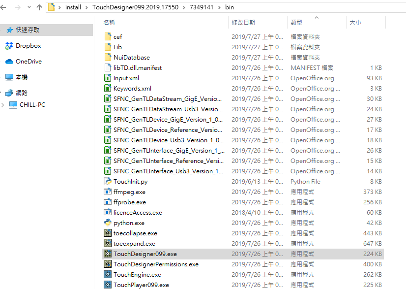

Install-TD-Experimental-win
---
### Installing Multiple Builds at Once
Sometimes you will want multiple builds of TouchDesigner or TouchPlayer installed at the same time. You may need older builds to test previous projects, or you may want to try out the latest features in **Experimental** while keeping **Official** installed for your current project.

And this little batch file makes it easy for you to do this. No need to enter any command line.
### How to use
1. Download [`TD-Install-Experimental.bat`](https://github.com/yeataro/TD_KIWI/raw/master/Install-TD-Experimental-win/TD-Install-Experimental.bat). 
2. Drag and drop your `TouchDesigner099.xxxx.xxxxx.exe` which you want to install to that downloaded [`TD-Install-Experimental.bat`](https://github.com/yeataro/TD_KIWI/raw/master/Install-TD-Experimental-win/TD-Install-Experimental.bat).

	

3. A window prompt appears to be extracting the file.
and that TD version will then be extracted to the folder named `TouchDesigner099.xxxx.xxxxx` in the folder where you placed `TouchDesigner099.xxxx.xxxxx.64-Bit.exe`.

	

4. The executable will be located at `[instal folder]\TouchDesigner099.xxxx.xxxxx\[random name]\bin\TouchDesigner099.exe`.
	
	
### Option
Using [`TD-Install-Experimental-option.bat`](https://github.com/yeataro/TD_KIWI/raw/master/Install-TD-Experimental-win/TD-Install-Experimental-option.bat) will automatically delete the useless files, saving more time.

----------
Author : Yea Chen <yeataro@gmail.com>

