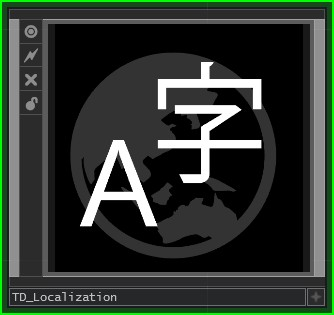
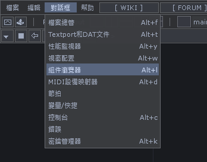
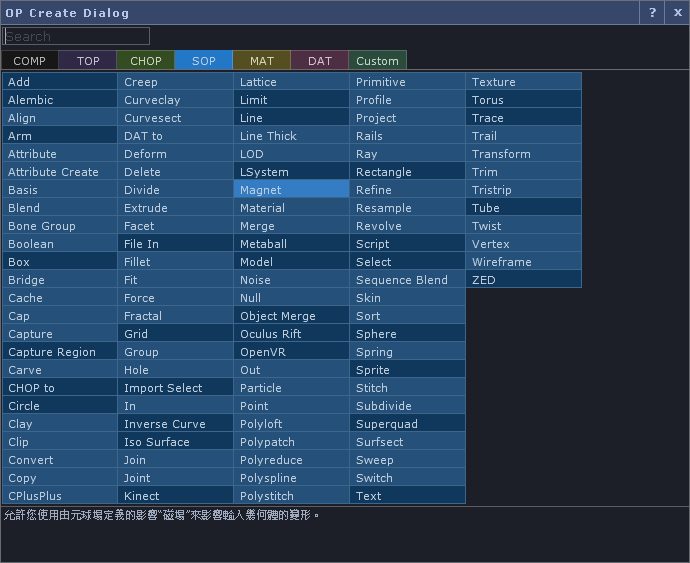
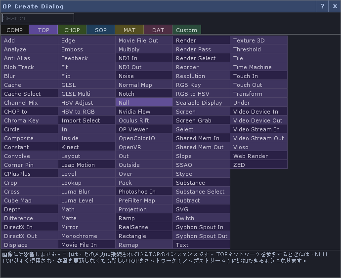

TD-Localization
---

Localize the TD user interface. Work in progress.

本地化TD使用者介面。工作進行中。

TDユーザーインターフェースをローカライズします。 作業は進行中です。

----------
### Current function: 

- Translatable menu. Move this thread to a separate [repository](https://github.com/yeataro/TD-Localization). There will be no updates here. (TD_Localization_omega.tox) #2019-07-22

- The description text of the translation OP Create Dialog is Traditional Han, Japanese, French, Russian, Spanish, Esperanto (Google Direct). The spreadsheet used for work is [here](https://docs.google.com/spreadsheets/d/1NJm6y2Eg9iyHv9mFdaBHJw_12bNU1CDQBGmgoTJVkHo/edit?usp=sharing). Welcome the language user to proofread the file together. (TD_Localization_beta.tox) #2019-07-11

- Translate the description text of OP Create Dialog to Traditional Han(Google straight translation).  The spreadsheet used in the work is [here](https://docs.google.com/spreadsheets/d/1NJm6y2Eg9iyHv9mFdaBHJw_12bNU1CDQBGmgoTJVkHo/edit?usp=sharing) #2019-07-10

### 目前功能： 

- 可翻譯功能表。將此線程轉移至獨立的[存儲庫](https://github.com/yeataro/TD-Localization)。這邊不會再做更新。 (TD_Localization_omega.tox) #2019-07-22

- 翻譯OP Create Dialog的說明文字為繁體漢語、日文
、法文、俄文、西班牙文、世界語(Google直翻)。工作使用的試算表[在這](https://docs.google.com/spreadsheets/d/1NJm6y2Eg9iyHv9mFdaBHJw_12bNU1CDQBGmgoTJVkHo/edit?usp=sharing)。 (TD_Localization_beta.tox) #2019-07-11

- 翻譯OP Create Dialog的說明文字為繁體漢語(Google直翻)。工作使用的試算表[在這](https://docs.google.com/spreadsheets/d/1NJm6y2Eg9iyHv9mFdaBHJw_12bNU1CDQBGmgoTJVkHo/edit?usp=sharing)。 #2019-07-10

### 現在の機能：

 -  OP Create Dialogのキャプションを台湾語と日本語、フランス語、ロシア語、スペイン語、エスペラント語で翻訳する（Google直接翻訳）。 仕事用スプレッドシートは[こちら](https://docs.google.com/spreadsheets/d/1NJm6y2Eg9iyHv9mFdaBHJw_12bNU1CDQBGmgoTJVkHo/edit?usp=sharing)。テキスト校正歓迎 (TD_Localization_beta.tox) ＃2019-07-11
 
 
 

----------

### To-do :

- The .tsv that will be published on the GOOGLE spreadsheet, automatically download and add byte-order mark, in order to solve this process, there will be garbled characters in the TD.
Update the translation text at any time with the editorial spreadsheet.

----------

> 使用提示：TD會自動修復它自己的UI，每次啟動TD都會復原為英語介面(實際上，任何的修改在"/ui"中都不會被儲存，它會重新在啟動時生成)，因此每次啟動都要翻譯一次。
> 
> ヒント：TDを起動するたびにTDは自動的に独自のUIを修正します（実際には、変更はすべて "/ ui"に保存されず、起動時に再生成されます）。 起動するたびに一度翻訳してください。
> 
> Tips: TD will automatically fix its own UI, each time you start TD will be restored to English interface(actually, any changes will not be stored in "/ui", it will be re-created at startup), So every time you start, you have to translate it once.

----------

Author : Yea Chen <yeataro@gmail.com>
