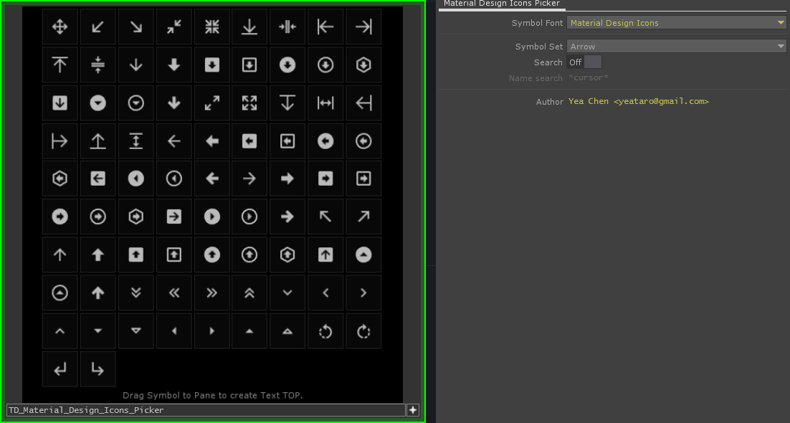

TD-Material-Design-Icons-Picker
---
Modify symbolPicker to Material Design Icons Picker.

Drag Icon to Pane to create Text TOP, Click on the icon to copy the `chr()` script to the clipboard.

Icon list from : <https://github.com/fgnass/mdi-json> @fgnass

---

Modifier / Author : Yea Chen <yeataro@gmail.com> 